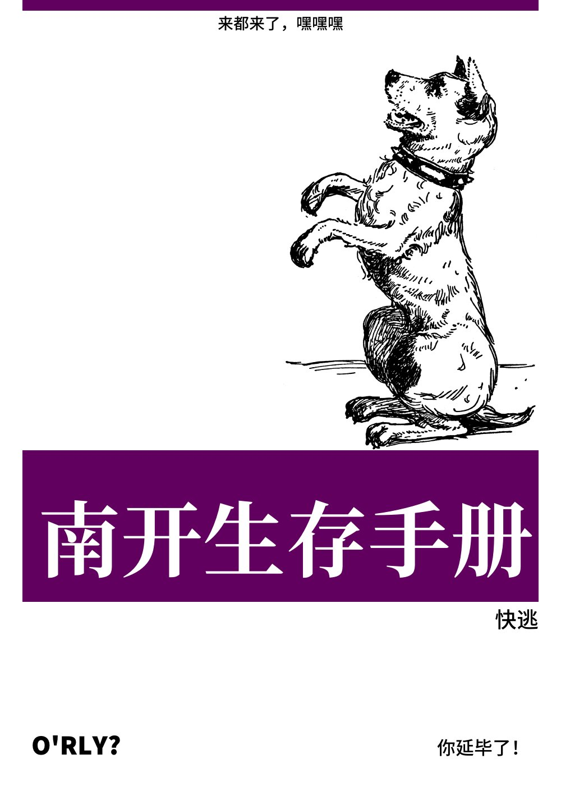

# 序言
(For contributers: please contact QQ:1849511586, email: c8h16o2@outlook.com, or check out and pull request at https://gitee.com/shengxin-li/nankai-survival-guide.)

##### 作者 201803 李盛忻
## 写在前面
2018年7月，我中考出分了。塘沽区第二，这意味着我可以从南开中学和一中里随意挑选。最终来南开了。  
考了这么高，谁还能没有点傲气？于是进去之后我就被艹趴下了。数学数学学不会，物理物理理不清，学校作业还写不完。选修课还去上了竞赛，竞赛入门考试我也没做出来几道，厚脸皮去蹭课，去了也听不懂。心态崩了。  
后来经过一系列心理建设，承认了自己水平也就是如此，就干脆好好学吧。秉承着跟紧老师步伐的主题思想，学习之余享受生活，高中三年也就逐渐顺风顺水地过来了，在社团方面也做了一些微小的工作，总体是很愉快的，成果也很满意。  
毕业了，暑假太长，事情太少，干脆就学习的同时作一作实践（做这个其实也有练习git使用的考量），也算是唯手熟耳。那么就写这本南开中学生存手册吧，帮一帮新来人，也回顾一下自己又迷茫又不迷茫的高中三年吧。  
李盛忻 2021/07/11

## 欢迎来到南开中学！

亲爱的小朋友(?)们，你们好！恭喜你们被南开中学录取，有幸成为南开大家庭的一员。  
在南开中学的经历会与初中乃至之前接触到的一切有相当大的不同，即使你是从本部直升上来的学生。高中一开始的迷茫一般也正来自于此，尤其南开还是一所传言中“管的很松”的学校。南开在于自由，学生易成于自由又易败于自由。  
先谈谈什么是南开中学的松/自由吧。这事情在高一高二体现的最为明显，高三不管怎么样老师都得下手。  
作业是讲到哪写到哪，不会天天收，每次收的时候收不齐也不会怎么样；如果计划留学，向老师请长假一般也都会批准；同时参加六七八九个社团，老师也不想管（虽然我没见过谁能同时整这么多活的）；谈恋爱，老师……有的老师就不管，有的老师管。  
总而言之，这里的松，相对于其他学校的严，在我看来可以用“家长形vs服务形”来类比。南开中学的资源会相当丰富，老师和学校会很愿意帮你一把；但如果你放任自流，那老师在几次提醒之后，可能就只会摇摇头，放弃你了。  
我的语文老师，柴慈瑾老师，她的观点我特别认同：

>诸位是/将要是成年人了，老师没有义务像小学那样手把手塑造自己的学生，诸位自己做出决定后应当自己承担相应的责任。  

这个观点是她在我们班没有完成好注释背诵的作业后提出的。相应的，在那天阴沉的气氛中，除了如此一番失望，课该上还是上了下去，没有什么别的惩罚。也算是从侧面反映出南开的自由吧。  
所以如果你能利用好南开的自由，南开将会把你塑造成具有独立意识、自我管理能力、自学能力的合格毕业生。如果放任自流，那……希望你不要劝别的学弟学妹不来南开。  
而在我们谈到如何利用这个自由的时候，我觉得应该先讨论一个问题：你要在南开做什么？

## 谋划未来三年
高中生活不像大学，没有类似于“面向科研/就业”等等的道路选择，大家学习高中知识，最后迎战高考，就差不离了。  
但也不止这一条路。要不要走特长生，乃至于干脆艺考/体考？要不要留学？要不要出国交换（疫情前有这种项目）？要不要学竞赛？**路子很多，学校能提供的资源也会相当丰富，但都需要你自己去争取。** 再往前倒一步说，你得先想明白，自己接下来三年要做什么，才能去有的放矢地自我奋斗，并结合历史进程。  
不能只是想。就像是幼儿园，老师问到大家的理想，肯定底下一片片的“科学家”“太空人”；但是过三十年，真能“不忘初心”的没几个。这就是眼界开阔了，信息获取的丰富了，对自己的能力、社会的状况有了更深入的认识，也就是从想一想转变成了查一查。所以说得去积极地获取信息。  
相应的，获取信息的方法有：
1. 咨询新生群里的学长学姐。比你们高出一两级的学长们可以给你们以最当下的信息，但是他们眼界可能会有局限性，不能给出太多人生经验；而对于那些不时出现的老狗，尤其是进了大学的，他们会给出更加高屋建瓴的想法，对学校、老师的了解也会更深入，但他们远离翔宇楼（高三在南院传鉴楼上课），乃至于远离南开中学，可能对于一些政策性与时效性的东西不太了解；他们给出的说法也或多或少显得油滑，可能本来就没想让你照做，得能看出来。建议多问多听多思考。
2. 上网查。查询南开中学相关信息，有如下推荐：  
    1. 知乎，搜索“南开中学”即可，甚至你可以看看@立党老师 关于南开中学的相应回答，平心而论，我觉得很有参考价值；
    2. 微信公众号，@天津市南开中学、@天津南开中学崛起报。
    3. 贴吧，但东西太老，适合考古；
    4. 微博，可以关注@南开虎哥 @南开中学团委，前者是德育处主任张小虎的微博，后者是团委，这两人的微博也可以或多或少展现南开生活。另，微博搜索“南开中学”，很多是粉王源的朋友在打卡重庆南开中学，导致搜索体验并不佳。
    5. [天津南开中学教师语录，哪一张是你的精神后花园](http://blog.sina.com.cn/s/blog_5a3406920102veyh.html)  

    查询学科的相关信息，除了咨询学长学姐之外，可以考虑在bilibili看网课、找电子课本先读一读。2020级学生用书我知道的是：地理用中图版，英语用外研版，其他科目用人教版（不讨论美术 音乐 技术等科目）。“电子课本网”比较全。家长帮等平台看一看可以，别太操心，家长们自己就能给自己灌输很多焦虑。。。  
    当年体创还有个官方网站，几年没有维护，过了一阵登上去，发现变成了麦片网站。。。  
3. 老师、机构（如留学与艺考机构，但警惕话术）：待补
4. 待补

在海量信息中查询之后，希望你能够大致搞明白自己接下来三年乃至七年、九年的努力方向是什么。暑假在快乐之余，就有必要开始准备了。

祝你成功！祝你快乐！