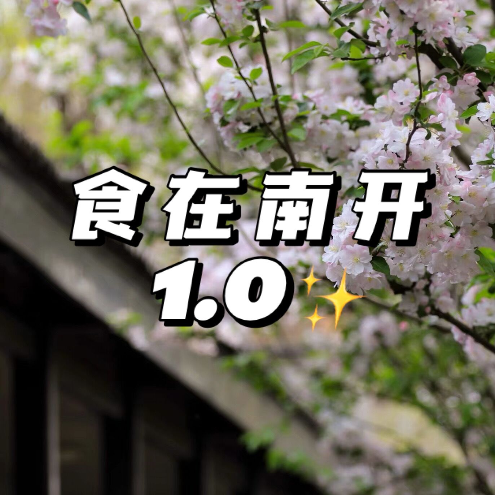

# 其它

## 南开中学食堂概述

**作者 202406 刘泽岳**&#x20;

**编辑者 APG**


这篇文章是[这篇文章](others.md#shi-zai-nan-kai-1.0)的更新版,不过与那篇文章并无直接关系

感谢**刘泽岳**的撰写


### 一、饭前须知

1. 饭钱结算：每一个窗口前有一个扫脸机器，开学前会连在家长的支付宝上，从父母支付宝里扣钱，如余额不足不能结账。单次饭钱超过五十左右不能收款，需要分批次结账。
2. 用餐时间：中午高一同学 ~~12：10~~ (上传者注: 2026年春季学期更改为12:20,尚且不知是否为永久更改)分下课后可以直接跑着去食堂，12：50午自习开始需要进班坐好，时间极其充裕。下午大课间北院提供酸奶和面包，统练第一节下课后提供小吃。南北两院均提供早餐，晚餐只有南院提供。
3. 用餐地点：北院南院都可以去，都是两层。北院二层不售卖食物，旁边是教师用餐地点。南院两层均提供食物，只有几位老师用餐。大课间做完操之后南院食堂食物公示就会亮出来，可以根据自己喜好决定中午用餐地点。
4. 饭前要洗手
5. ~~食堂内用手机是安全的~~

### 二、食物提供之北院中午

1. 第一窗口

* 上传者注: 2026年春季学期增加了披萨,个人感觉很好吃(16r),一人限购一份
* 猪肉大葱、香菇、猪肉白菜馅的饺子（16元）
* 包子套餐包括包子、小菜、小米粥，有大小份之分
* 烤肠、香芋派等（3-5元）
* 要点：饺子和包子不同时出没，以饺子为主，一楼二楼都有醋和辣子。饺子推荐，包子不推荐。零食不定时出没，可以买。如果想吃这个窗口的，可以从食堂侧门进，省时间。

2. 第二窗口

* 扬州炒饭、酱油炒饭、首尔炸鸡炒饭、通心粉等（16-18元）
* 饮料（6元）、九阳豆浆（4/5元）
* 要点：这个窗口的主食极其难吃，一点肉没有味道还很怪，谁买谁吃亏。饮料为南开特色的色素小甜水，喝了有害健康，但是偶尔买一次摆在桌子上也可以。豆浆饭后可以买一杯，溜溜缝挺舒服的。

3. 第三窗口

* 蛋挞（3元）、饮料（6元）、各种小面包小蛋糕（4-6元）
* 炸鸡汉堡、虾饼汉堡（16元）(上传者注: 个人学习的一年里目前没看到汉堡,反而承担了包子这种第一窗口的餐食)
* 要点：如果排队买饭，买完之后这些东西点心就会售罄，所以可以和你的好朋友分头行动。炸鸡汉堡可以买，虾饼汉堡不好吃，像喝盐水。

4. 第四、五窗口

* 排骨面、金汤肥牛面、打卤面等（14-16元）
* 卤蛋、火山石爆蛋、豆皮等（1.5元左右）
* 要点：打卤面味道还可以，但和天津老味还是差了一点点，金汤肥牛面有一点辣，其他的面不建议吃，可以去南院品尝高等面条。

5. 第六窗口

* 卤肉饭、红烩鸡块饭、香辣鱼饭、番茄牛肉饭，鸡腿饭等各种盖饭（16-18元）
* 要点：这个窗口全部推荐，尤其推荐番茄牛肉饭（可能有点硬），红烩鸡块饭如果去的早会是带芝士的(上传者注: 带芝士的会被标注为xxx焗饭)。唯一的缺点是这个窗口的食堂阿姨脾气不太好，大家要认真核对自己是否缴费成功。

6. 第七、八、九窗口

* 各种炒菜，自己选，一份正常搭配大概13-16元
* 要点：性价比最高的窗口，重口难调，每个人喜欢吃的菜都不一样，但我和我的朋友们比较喜欢的菜是糖醋鱼条，干锅千叶豆腐，咖喱鸡。饭量大的同学点餐时直接说多要点米饭，不用点两份米饭。如果吃带汤儿的菜记得从一楼拿个勺霍米饭吃。

### 三、食物提供之南院中午

1. 一楼左半侧窗口

* 意大利面，钵钵鸡，鸡排饭，轻食套餐等（16-18元）
* 饮料（6元）
* 高一年级同学下课晚，去了可能就没了，一下课跑着去南院可能有希望。比较推荐钵钵鸡和鸡排饭，饮料和北院一样。

2. 一楼中间窗口：和北院第三窗口差不多，不多赘述。
3. 一楼右半侧窗口：和北院第七、八、九差不多，不多赘述。如果想吃炒菜不必要来南院，
4. 二楼最右侧窗口回民窗口：不是只为回民同学提供，其他民族学生也可以买，每天固定的菜，味道据我回民同学说很可以，不能选择，16元。不建议其他民族同学购买，因为这样回族同学可能就会没饭吃。
5. 二楼最左侧窗口：加面和购买凉菜的地方。凉菜坑人，不建议买，小碗加面1元大碗加面免费，也有免费绿豆汤提供。
6. 二楼其余所有窗口

* 火锅鸡面、鸡丝凉面、小酥肉面、肥牛面、麻辣香锅面、担担面等各种面（小碗15元大碗18元）(上传者注:个人感觉南院的面食同质化较为严重)
* 卤蛋（1.5元）
* 笑脸薯饼，土豆块、芝士小鸡排等各种炸物（6-8元）
* 饮料（6元）
* 要点：各种面分辣汤和不辣汤，买前要提前告知。个人喜爱鸡丝凉面和小酥肉面。如果吃担担面记得拿勺子吃里面的肉末。每一种面都可以尝试一次，根据自己喜好去购买。小吃不太值，但是几个朋友互相分享也是一种快乐。

7. 南院二楼小料台：花生碎，黄金豆，辣子，醋，香菜，葱。根据个人情况适量添加，不要浪费。也不要因为南院某些初中生的一些行为发生争执。

### 四、食物提供之北院早晨和大课间

1. 早餐有方便面、九阳豆浆、包子、肉夹馍、烧饼火腿等。具体价钱不知道，不住校的同学不建议吃，吃一次体验一下可以，不如家门口早点摊。
2. 大课间有各种面包（8-12元）、各种酸奶（1-2元）以随机出没的一些果冻之类的，饿了可以垫吧垫吧。

### 五、食物提供之南院统练和晚上

1. 统练有拇指生煎包、冒菜、地瓜条、玉米、红薯条、醪糟、烤面包、葱香饼、糯米糍粑等等等等，食物会经常更新，价钱在3-10元不等。周一体育跑完步可以去买一些吃的垫吧垫吧。(上传者注: 推荐南院1F的猪肉包,仅需1.5r)
2. 南院晚上饭和午饭类型几乎一样，只不过种类会减少。

### 六、结语

南开食堂是一个良莠不齐的地方，每一种食物都值得去尝试，每一次用餐都值得去回忆。以上内容仅代表我一个人的观点，如有错误请谅解。希望大家未来三年吃好喝好，以一个强壮的身体去面对高中生活的每一天。谢谢大家。

上传者注：

1. 北院提供火山石烤肠,酸奶,和面包这类食物,与南院通常提供的炸物不同

***


以下信息大部分**已过时**，仅用于存档


## 食在南开1.0✨

**作者 201803 一瓶酸奶**

### 写在前面

小瓶作为南开的三年老住宿人（bushi/，在食堂、周边店、外卖均有涉猎，能吃微辣～中辣，非官方集锦来看看吧（狗头）！

### 食堂篇

小瓶高一一年认认真真兢兢业业除了考试周为了节省时间在宿舍复习点外卖，基本就是早中晚吃食堂✓，早上小瓶一般直接在南院食堂买好早饭外带，南院早饭有鸡蛋、豆浆、紫米粥、大饼夹鸡蛋\鸡排等等，2020年北院早饭种类要比南院更加丰富。午饭南北院食堂均供应，具体看每年每天啦！**晚饭只有南院食堂供应（截止到2021年是这样）**，食堂曾经出过正常菜饭、面类、焗饭、麻辣烫……（除了正常菜饭和面类建议不要尝试新品……唔，小瓶有很痛苦的体验，如果听大家说好吃可以再414）打个友情广告：**最好吃的麻辣烫见下文周边店！！！** 面类还是不错的，可以跟叔叔阿姨说加面（免费的XD）「在小瓶胃口很大的那几个月」\
**食堂福利**：一般端午节会有粽子，冬至会有饺子供应，食堂的中、晚餐都会有汤！（小瓶最爱）记得和食堂叔叔阿姨说谢谢！他们会感到快乐的XD 同时你也会快乐🦆\
**食堂时刻**：**早餐**南北院按理说6：30开门供应，有的时候可能6：50供应比较齐全，7：00可能需要排队，如果早上来不及吃饭，下早自习可以去食堂看看，可能会有剩余大饼鸡排✓ **中餐**建议在哪院上课去哪里吃饭，不然远距离抢食堂很麻烦（小瓶比较懒惰不愿走路TT）也可以提前订餐（小瓶不太挑食就吃下来了三年）「如果体育课或者自习课一般是能抢食堂的！北院人就可以去南院啦哈哈（换种心情」**晚餐**只有南院供应，一般来说大部分是住宿同学和高三同学，高三晚下课食堂人多可以考虑去校外\提前外卖（见下周边店\外卖篇）

### 周边店

**便利店**：人类的福音！！！小瓶最常去南院后面的便利蜂和711（711经营不善倒闭了TT），没关系二纬路c口出来还有一个711，可以买到各种东西。**强烈安利便利蜂的冰豆浆**，一杯1.5r，小瓶和朋友都爱喝，两家的饭团、三明治都不错，店里微波炉热一热就是一顿饭XD（如果需要微波炉旁边正好有这些便利店，去那里热一热也可以，店员都好友善TT），小瓶和朋友亲身尝试，**711的鸡丝凉面**比便利蜂的好吃（先把面搅开再倒酱料！），夏日一绝！！！还有**冰红茶的热带风味**口味太好喝了TT另外还有便利店里面的**小蛋糕**！小瓶每周回家都会带一个尝尝（XD）另外推荐一个类似于辣条的东西：**魔芋爽**（绿色的比红色的好吃）省钱小技巧：便利蜂的面包一般有的打折，可以看上面哪个打折会省一部分小钱，两家的酸奶牛奶有时候也会特价处理，注意看标签！两家的熟食也很好吃！小瓶最爱便利蜂的藤椒鸡排，好吃不贵，还有一些串串，711的关东煮里的白萝卜和汤！欢迎大家尝试！「未来是属于你们的嘿嘿嘿」\
**百基拉**：单列出来，这可能是南开学子的共同回忆（有很多经典店铺在2020年之后都倒闭了，但是百基拉仍然！坚强的在街角！）小瓶习惯点套餐一可乐换雪碧（方便携带）大家自己探索吧！15r左右\
**出南院门右拐小路再右拐**：

1. 宝盛元饺子：牛肉胡萝卜好吃！15个一盘，价格适中？有点小贵？18-23r可以点颂饭水饺更加便宜（见下）
2. **旁边的麻辣烫店**：小瓶高三一年的精神支柱TT（我太爱吃了 尤其连续考完三小时统练之后）我愿称之为！又便宜又好吃！！高考完还要午夜梦回！！！这真的令我魂牵梦绕TT小瓶的均价：13-18r（点微辣）一般小胖会选择手擀面➕2蘑菇➕1红薯➕部分土豆粉（再来一条宽粉）➕2鸭血➕2鹌鹑蛋➕2培根 麻辣拌也很神仙但是小瓶没太吃过 小瓶的朋友们很爱腊肠！搭嘎可以414 「注：店面装修一般偏差，有洁癖的朋友……」
3. 包子店：这家店的西红柿面➕一个鸡蛋特别神仙！！！！！！！（小瓶深夜编文已经在流口水了TT）包子就很好吃！看着点吧！蒸饺一般不太推荐，可以再试试方便面XD 13r左右
4. 馄饨店：中规中矩也很好吃！12-20r
5. 清真牛肉面店：味道很好！！！小瓶只吃过牛肉拉面，11r一碗，加面提前说是免费滴（不要香菜和葱也需要提前说yo）
6. 暂时忘记了TT\
   出南院门右拐再左拐：一路直走有达美乐披萨、麦当劳等等，这个就不详细描述了，都是连锁店

### 外卖篇

1. 抖香锅🌟🌟🌟🌟🌟：小瓶最爱的麻辣香锅店！！！满减力度大，建议第一次点点微辣（不能吃辣就点酱香），绝绝子！！！感觉盲点也不会失误！价位：20r左右
2. 兄弟过桥米线🌟🌟🌟🌟🌟🌟：小瓶本来不爱吃米线但是这家绝绝子！！！米线配麻油赛神仙！小瓶点小份就够吃了（饭量相当于一碗面）不爱配菜的可以换比如小瓶就喜欢豆皮换豆芽XD 价位：12r左右
3. 景德园过桥米线🌟🌟🌟🌟：味道也不错，比上家稍逊，价格也稍贵，可能看个人口味，但是小瓶周边朋友都更爱兄弟过桥米线，大家自行尝试吧！ 价位：14-19r
4. 桃园煲仔饭🌟🌟🌟🌟🌟：这家yyds！点双拼腊味你不会后悔的！！好吃极了！美中不足有点小贵 价位：22r左右
5. 社会王炒饭🌟🌟🌟🌟🌟：饭量很大（长身体ing的男生的正常饭量）而且便宜！点招牌就好！这家是有一点油，但是会让你真香的油！！！好吃szd，小瓶饭量少的时候吃一半就饱了XD 价位：14～17r
6. 津味张记包子铺🌟🌟🌟🌟：鲜肉包和茴香包！真的好好吃！！！！！！也是我吃过的最好吃的！！！！（小瓶又饿了）价位：12-22r（主要看你饭量啦）
7. 颂饭精致水饺🌟🌟🌟：喜欢吃饺子的准没错，这家比宝盛元便宜，相信聪明的小茄子🍆会掌握满减要诀的！小瓶一般花费18r左右吃撑嘻嘻
8. 江川右：一家粥店（感觉比曼玲粥铺卫生一点点……）粥：皮蛋瘦肉粥yyds 甜党也可自行！（俺是南瓜粥加糖XD）小食看着点吧！ 价位 14-17r
9. 鲍师傅甜点🌟🌟🌟🌟🌟：肉松小贝闭眼入吧！真的无敌爆炸螺旋上天好吃TT不过不建议买多，2-3个足够了，买多了就不珍惜了甚至有点腻，价格小贵，也可以去实体店XD
10. 熊家韩式炸鸡🌟🌟🌟🌟：小瓶心中的炸鸡朱砂痣：便宜！！（感觉炸鸡味道都差不多）适合2-3人一份（蜂蜜芥末yyds！）有满减券就更便宜啦
11. 达美乐披萨🌟🌟🌟🌟🌟：适合周二周三上vx店家小程序里点（会打折）是真的好吃！！小瓶和朋友喜欢点经典款不会踩雷XD
12. 鱼你在一起：这家店的毛血旺🌟🌟🌟🌟🌟🌟是我吃过！最好吃的！！！（in北方地区，很久没去川渝了忘记味道了TT）不是很辣超级好吃！！！42r一份适合两个人吃，去现场吃可以无限续添米饭XD鱼唔，可能小瓶不咋爱吃）
13. 最后 黄焖鸡米饭我觉得点哪一家都不会踩雷🤝 价位15r左右

### 写在最后

㊗️大家的南开生活快快乐乐幸幸福福！（吃也是为生活增色的一大乐趣吖）在你自闭的时候，不妨用美食慰藉自己的心灵XD未来的世界广阔着呢！

### 编者后注

永远怀念：小馋猫烤肉拌饭，大排面，咖喱饭（虽然有一次吃出了金属），麦高汉姆，过桥米线，南开美食街（据学长回忆：有卒于18年的轻风之语，卒于16年的焗饭，卒于21年初的义乌小商品（在二纬路地铁站C口的上盖，改成教培了，但现在整治课外培训之风起了，又要改成什么呢……虽然这家不是吃的吧））,西南角劝业场对面的正新鸡排、串炒饭……城管先来，疫情后至，也就不剩什么了，唯一的是摆摊的烤冷面店转到室内了。另外，亘古之前，学校食堂的运营商是“南开阳光”，大概在15年春学期结束时撤出，后“中山美食林”接手。据说，食堂的食物水平有显著下降。

## 体育选修课推荐

**作者 201803 李盛忻**

南开中学一周安排两节体育课（对，高三也是两节），一节课是正课，另一节课是选修课，这节课同学自己选择学什么内容。可选的内容一般是足篮排（足球限男生）、羽毛球垒球乒乓球、瑜伽（限女生）、武术。羽毛球科目限制报名人数，但是超了一般也不会怎么样，还会有很多编外人员去打球。游泳馆于2020年8月底重新投入使用，但似乎目前体选课还不可以学游泳。我觉得也不现实，毕竟还要考虑更衣问题。\
理论来说，每到新学期，重新选择的时候（高三下学期不选，与高三上学期相同），应该选别的科目。但是老师也不管。所以我就打了三年的羽毛球。\
羽毛球、乒乓球需要自己携带设备，比如球拍、球。但是有的时候经常是，一个金主爸爸买了一桶球，大家一起用，然而羽毛球这运动又很耗球，过了几节课，大家就都在拿烂球打了……直到另一个金主爸爸买一桶新的。\
有的科目查考勤比较严，有的科目查的就不严。一般来说，到高三了，老师就真不管了。这就导致大家都去打羽毛球（因为在体育馆内上课，风吹日晒与我们无关；外加群众基础好），场地装不下了……\
体选课教的比较浅，一般也就是能够让学生会打球，但是怎么打得好，可能就不教了。比方说，羽毛球课会教大家如何发球、接打高远球、挑球，而小球怎么打，基本上没教过。可能上课前10-20分钟集体学习，剩下时间分组自己打球玩。高三那阵，做完准备活动，简单说两句，大家就自由练习了。另外，老师时不时会巡场，给予指导，但更多的时候在座位上远望大家，高瞻远瞩，玩手机……其他科目的具体内容问学长学姐吧。\
一般来说，喜欢什么就报什么，不要太功利性。体选课在保证安全的绝对前提下，追求快乐就好。也可以问问其他人，关于老师考勤的严格程度。如果还想逃课写作业，或是去上别的球类，太严格的老师就不适合了。
